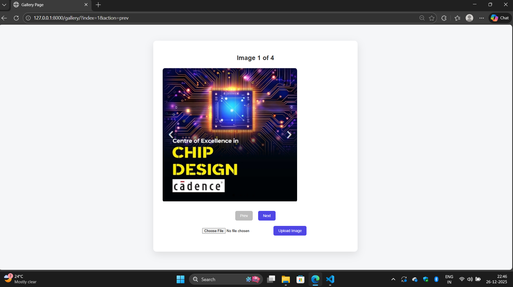
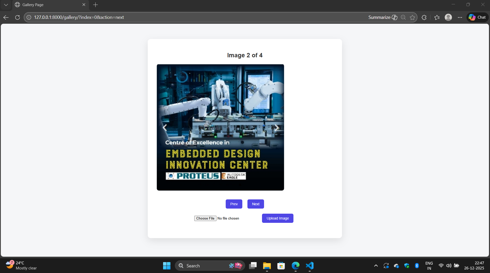
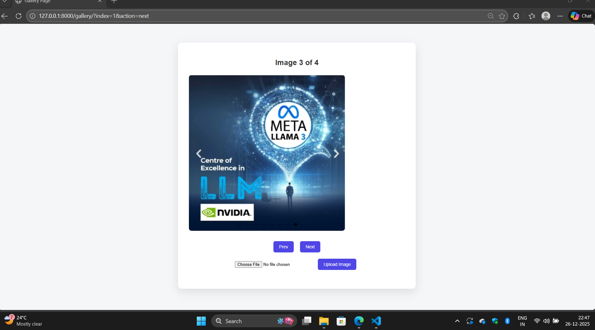
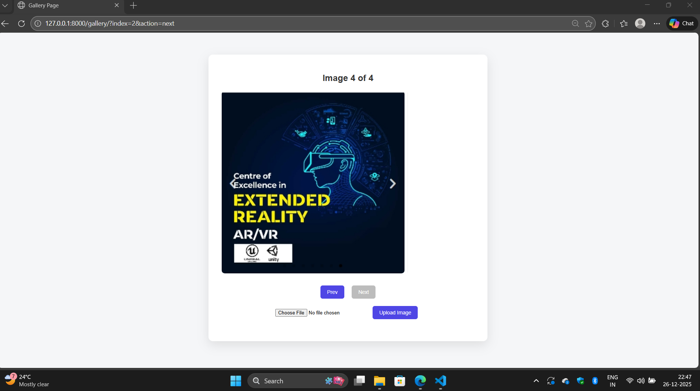

# Ex.08 Design of Interactive Image Gallery
## Date:

## AIM:
To design a web application for an inteactive image gallery with minimum five images.

## DESIGN STEPS:

### Step 1:
Clone the github repository and create Django admin interface.

### Step 2:
Change settings.py file to allow request from all hosts.

### Step 3:
Use CSS for positioning and styling.

### Step 4:
Write JavaScript program for implementing interactivity.

### Step 5:
Validate the HTML and CSS code.

### Step 6:
Publish the website in the given URL.

## PROGRAM :
```
gallery.html
<!DOCTYPE html>
<html>
    <head>
        <title>Gallery Page</title>
    </head>
<style>
        body {
            margin: 0;
            padding: 0;
            background: #f5f6f8;
            font-family: Arial, sans-serif;
        }

        .maincontainer {
            max-width: 700px;
            margin: 60px auto;
            padding: 30px;
            background: #ffffff;
            border-radius: 12px;
            box-shadow: 0 10px 30px rgba(0, 0, 0, 0.1);
            text-align: center;
        }

        .maincontainer h2 {
            margin-bottom: 20px;
            color: #333;
        }

        .maincontainer img {
            max-width: 100%;
            border-radius: 8px;
        }

        .maincontainer button {
            padding: 10px 18px;
            margin: 10px 8px;
            border: none;
            border-radius: 6px;
            background: #4f46e5;
            color: white;
            font-size: 14px;
            cursor: pointer;
        }

        .maincontainer button:disabled {
            background: #bcbcbc;
            cursor: not-allowed;
        }

        .maincontainer button:hover:not(:disabled) {
            background: #4338ca;
        }
    </style>
<body>

<div class="maincontainer">
    

<h2>Image {{ index|add:1 }} of {{ total }}</h2>


<form method="get" style="display:inline;">
    <input type="hidden" name="index" value="{{ index }}">
    <button name="action" value="prev" disabled>
        Prev
    </button>
</form>

<form method="get" style="display:inline;">
    <input type="hidden" name="index" value="{{ index }}">
    <button name="action" value="next" disabled>
        Next
    </button>
</form>
<form method="post" enctype="multipart/form-data" style="margin-bottom:20px;">
    
    <input type="file" name="image" accept="image/jpeg" required>
    <button type="submit">Upload Image</button>
</form>

</div>
</body>
</html>

views.py

import os
from django.conf import settings
from django.shortcuts import render,redirect

def gallery(request):
    image_dir = os.path.join(
        settings.BASE_DIR,
        'galleryapp',
        'static',
        'figure'
    )
    if request.method == 'POST' and request.FILES.get('image'):
        uploaded = request.FILES['image']

        if uploaded.content_type =="image/png":
            existing = [
                int(os.path.splitext(f)[0])
                for f in os.listdir(image_dir)
                if f.endswith('.png') and os.path.splitext(f)[0].isdigit()
            ]

            next_index = max(existing) + 1 if existing else 0
            file_path = os.path.join(image_dir, f"{next_index}.png")

            with open(file_path, 'wb+') as destination:
                for chunk in uploaded.chunks():
                    destination.write(chunk)

        return redirect('gallery')


    # Collect only numeric jpg filenames
    images = []
    for f in os.listdir(image_dir):
        name, ext = os.path.splitext(f)
        if ext.lower() == '.png' and name.isdigit():
            images.append(f)

    # Sort numerically (0.jpg, 1.jpg, 2.jpg...)
    images.sort(key=lambda x: int(os.path.splitext(x)[0]))

    total = len(images)

    # Default index
    index = request.GET.get('index', 0)
    try:
        index = int(index)
    except ValueError:
        index = 0

    # Navigation logic (Django if / elif)
    action = request.GET.get('action')

    if action == 'prev':
        index -= 1
    elif action == 'next':
        index += 1

    # Clamp index safely
    index = max(0, min(index, total - 1))

    context = {
        'image': images[index] if images else None,
        'index': index,
        'total': total,
    }

    return render(request, 'gallery.html', context)


```
## OUTPUT:




## RESULT:
The program for designing an interactive image gallery using HTML, CSS and JavaScript is executed successfully.
